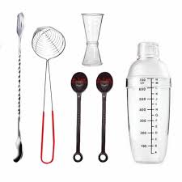

<!DOCTYPE html>
<html lang="en">
<head>
<meta charset="UTF-8">
<meta name="viewport" content="width=device-width, initial-scale=1.0">
<title>Milk Tea Page</title>

</head>

<body>

<nav>
    <a href="#">Home</a>
    <a href="#">learn</a>
    <a href="#">contact</a>
</nav>
    

    <h2>Equipment and ingredients for making milktea</h2>

    

        

            
            <ul>
                <li>Bar spoon small</li>
                <li>Pearl Scooper</li>
                <li>Coffee spoon big</li>
                <li>Clear jigger small</li>
                <li>Clear cocktail shaker 350ml</li>
            </ul>
        

        

            
            <ul>
                <li>Black Tea</li>
                <li>Brown Sugar</li>
                <li>Milk</li>
                <li>Tapioca Balls</li>
                <li>Water</li>
                <li>Ice</li>
            </ul>
        

        

            
        

    

    <h2>Contact Us</h2>

    

        
<strong>Email:</strong> angiefatalla@gmail.com

        
<strong>Phone No:</strong> 09623428152

        
<strong>Address:</strong> Sara Smile, 123 Giggle Ave, Richmond, VA 22548

    

    <form>
        <input type="text" placeholder="Full Name:">
        <input type="email" placeholder="Email:">
        <textarea placeholder="Message:"></textarea>
        <button type="submit">Send</button>
    </form>

</body>
</html>

